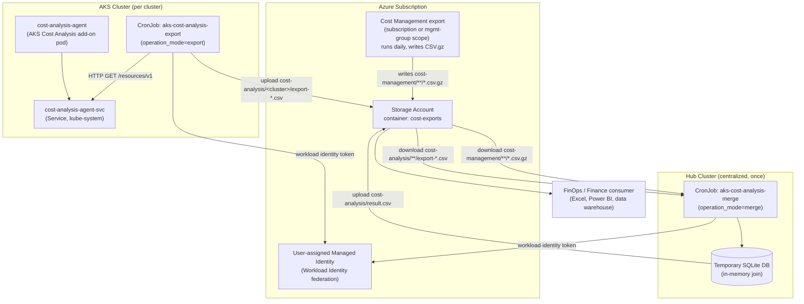
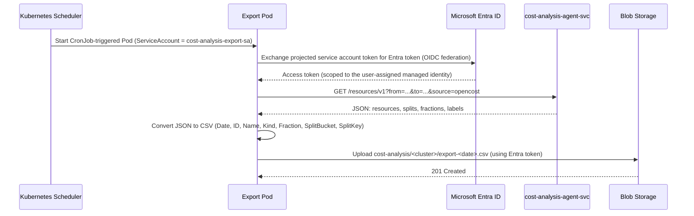
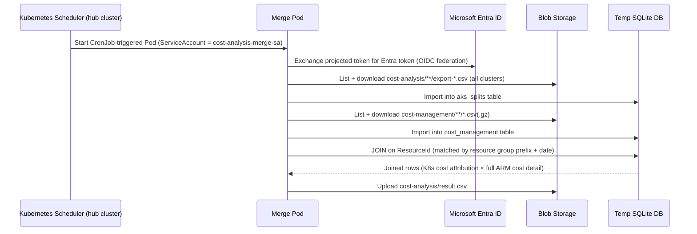

# Architecture

## Overview

The solution has two logical phases, run as separate (or combined) container
invocations of the same binary:

1. **Export** — runs once per AKS cluster. Calls the in-cluster Cost Analysis add-on
   agent's HTTP API, converts the response to CSV, and uploads it to a cluster-specific
   path in Blob Storage.
2. **Merge** — runs once, centrally. Reads every cluster's exported CSVs plus the
   customer's Azure Cost Management export, joins them in a temporary SQLite database,
   and writes a single combined `result.csv` back to Blob Storage.

Both phases are the same Go binary (`aks-ca-export`); the operation is selected by a
command-line argument (`export`, `merge`, or `both`).

## Data flow diagram

## Workflow: export phase (per cluster, daily)

## Workflow: merge phase (centralized, daily, after all exports)

## Why the join works: the data model

- **AKS-side data** (`aks_splits` table): one row per Kubernetes-level cost "split" —
  the fraction of a given Azure resource's cost attributable to a namespace/deployment,
  keyed by the full Azure `ResourceId` of the underlying compute/network/storage
  resource (e.g. a VMSS instance, a public IP).
- **Cost Management-side data** (`cost_management` table): standard Azure Cost
  Management usage export columns — `ResourceId`, `meterCategory`, `meterName`,
  `costInBillingCurrency`, `tags`, etc. — one row per resource per day.
- **Join key:** the resource group portion of `ResourceId` (case-insensitive prefix
  match) plus date. This is necessary because the AKS-side `ID` values reference
  node-pool-level resources (VMSS, VMSS instances) that live in the AKS-managed
  resource group (`MC_<rg>_<cluster>_<region>`), while Cost Management data is emitted
  per exact resource. The join finds all cost-management rows whose resource group
  matches an AKS resource's resource group for the same day, then left-joins the
  fractional split data on top — so a resource with no matching split still appears,
  tagged `__unallocated__`.

## Scope and scale: one cluster vs. many

### Single cluster (simplest topology)
Run in `both` mode: one CronJob per cluster does export + merge together, writing
directly to `cost-analysis/result.csv`. No storage-path sharding needed. This is what
the original `deploy.sh`/`kube.yaml` in this repo implement.

### Many clusters (recommended pattern for 10+ clusters, required in practice above ~20)
Running `both` on every cluster doesn't scale cleanly:
- Every cluster's merge phase re-downloads and re-joins **all** other clusters' data —
  O(n) redundant work per cluster, O(n²) total work across the fleet.
- Multiple clusters writing to the same `cost-analysis/result.csv` concurrently is a
  race condition (last write wins, and there is no locking).

Instead, use the **separated export/merge pattern**:
- Every cluster runs `export`-only, with `AZURE_STORAGE_AKS_DATA_PREFIX` set to a
  cluster-specific path (`cost-analysis/<cluster>/`).
- One dedicated **hub** location (any single cluster, or a lightweight standalone
  runner — see [Terraform modules](05-terraform-modules.md)) runs `merge`-only against
  the shared root prefix (`cost-analysis/`), which recursively picks up every cluster's
  export files regardless of subfolder depth.

This is the pattern the Terraform scaffold in this repo implements by default
(`modules/workload` parameterized by `operation_mode`).

### Scale limits to plan around
- **Federated identity credential quota**: a single user-assigned managed identity has
  a default limit of 20 federated credentials (one per cluster's OIDC issuer). Beyond
  ~20 clusters, either request a quota increase (can take time — start early) or shard
  clusters across multiple identities (`identity_count` in `modules/shared`).
- **Cost Management export scope**: a single export can be created at management-group
  scope, covering every subscription under it — avoids needing one export per
  subscription when a fleet spans several subscriptions.
- **Storage**: one shared storage account/container works fine for dozens of clusters
  at typical daily-export volumes; apply a lifecycle policy to expire raw per-cluster
  exports after 30 days while keeping `result.csv` indefinitely (already default in
  `modules/shared`).
