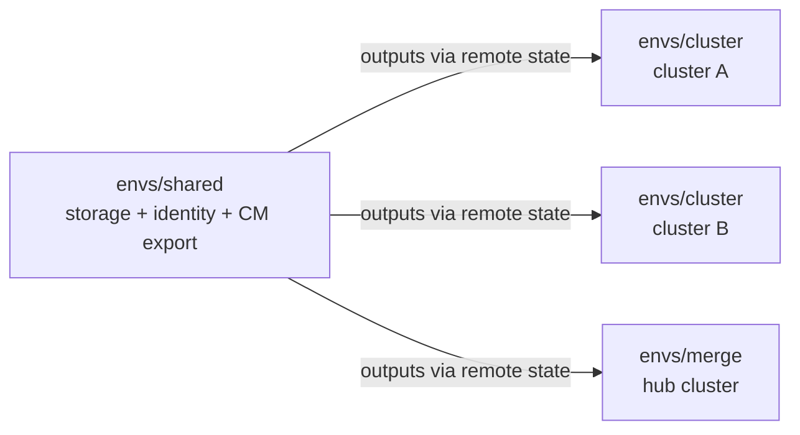

# Terraform deployment guide

This guide deploys the solution end to end using the Terraform scaffold in
[`terraform/`](../terraform/). It's written to be followed literally, in order, without
prior knowledge of this codebase. If Terraform isn't available or approved in your
environment, use the [manual deployment guide](10-manual-deployment-guide.md) instead —
it produces the same result through the portal and Azure CLI.

Every command below shows the directory it runs from. Run them in the order given.

## What Terraform will create

The scaffold is split into three **root modules** under `terraform/envs/`. Each has its
own state file, and they're applied in sequence because later ones read outputs from the
first.

| Root module | Apply how often | Creates |
|---|---|---|
| `envs/shared` | Once per tenant | Resource group, storage account, blob container, lifecycle policy, one or more user-assigned managed identities, `Storage Blob Data Contributor` role assignments, and the Cost Management export |
| `envs/cluster` | Once **per cluster** | Federated identity credential, `cost-analysis` namespace, ServiceAccount, `cost-analysis-agent-svc` Service, and the `export` CronJob |
| `envs/merge` | Once for the fleet | Federated identity credential, ServiceAccount, and the `merge` CronJob on one hub cluster |



Both `envs/cluster` and `envs/merge` consume `envs/shared`'s outputs through a
`terraform_remote_state` data source. That's why order matters, and why the shared state
must be reachable from wherever you run the later applies.

See [Terraform modules](05-terraform-modules.md) for the design rationale behind this
split.

## Prerequisites

### Tools

| Tool | Version | Notes |
|---|---|---|
| Terraform | >= 1.7 | `required_version` in each root module |
| Azure CLI | current | Terraform authenticates through your `az login` session |
| `kubectl` | matching your clusters | The `kubernetes` provider reads your kubeconfig |

You don't need Docker. `az acr build` builds the image server-side.

### Sign in and select the target cloud and subscription

```powershell
az cloud set --name AzureUSGovernment   # omit this line for Azure public cloud
az login
az account set --subscription <subscription-id>
az account show --query "{sub:name, id:id, tenant:tenantId}" -o table
```

The `azure_environment` Terraform variable must agree with the cloud you selected here.
Use `usgovernment` for Azure Government or `public` for Azure public cloud. A mismatch
produces confusing authentication errors rather than a clear failure. Each root module
also takes `tenant_id` and `subscription_id`, so Terraform deploys to the subscription
you name rather than whichever one `az account set` selected.

### Azure permissions

You need to be able to create resource groups, storage accounts, managed identities,
**role assignments**, and Cost Management exports in the target subscription. Role
assignments require **Owner** or **User Access Administrator** — Contributor alone fails
at `azurerm_role_assignment`.

### Register the Cost Management resource provider

```powershell
az provider register --namespace Microsoft.CostManagementExports
az provider show --namespace Microsoft.CostManagementExports --query registrationState -o tsv
```

Wait until this prints `Registered`. It can take a few minutes. Applying before then
fails with `RP Not Registered` (HTTP 400).

### Per-cluster prerequisites

Terraform does **not** configure the clusters themselves — it deploys workloads onto
clusters that are already set up. For every participating cluster, confirm all four:

```powershell
# 1. Pricing tier must be Standard or Premium (Cost Analysis is unavailable on Free)
az aks show -n <cluster> -g <cluster-rg> --query sku.tier -o tsv

# 2. OIDC issuer and workload identity
az aks update -n <cluster> -g <cluster-rg> --enable-oidc-issuer --enable-workload-identity

# 3. Cost Analysis add-on
az aks update -n <cluster> -g <cluster-rg> --enable-cost-analysis

# 4. Image pull access from your registry
az aks update -n <cluster> -g <cluster-rg> --attach-acr <acr-name>
```

If step 4 can't resolve the registry by name, or you don't hold the rights it needs, see
[step 3.2 of the manual guide](10-manual-deployment-guide.md#step-32--let-the-cluster-pull-from-the-registry)
for the equivalent role assignment plus the service principal and private registry
variations.

Verify the add-on is actually running before you deploy anything:

```powershell
kubectl get pods -n kube-system -l app=cost-analysis-agent
```

---

## Step 1 — Build and push the image

From `examples/cost-analysis-export`:

```powershell
az acr build --registry <acr-name> --image aks-cost-export:latest .
```

Record the full image reference — you'll set it as the `image` variable in steps 3 and 4:

```powershell
az acr show -n <acr-name> --query loginServer -o tsv
# e.g. <acr-name>.azurecr.us  ->  <acr-name>.azurecr.us/aks-cost-export:latest
```

## Step 2 — Deploy shared infrastructure (`envs/shared`)

### Step 2.1 — Choose a backend

The scaffold ships with a local backend, which keeps state in a file on your machine.

- **Single operator, POC:** keep the local backend. Nothing to configure. Be aware the
  state file is gitignored and lives only on that machine — if it's lost, you have to
  `terraform import` the live resources to recover.
- **Team or CI, or anything beyond a POC:** use an `azurerm` backend so state is shared
  and locked. Copy the example and fill it in:

```powershell
cd terraform/envs/shared
Copy-Item backend.hcl.example backend.hcl
```

```hcl
# backend.hcl
resource_group_name  = "tfstate-rg"
storage_account_name = "tfstateaksfinopsxxxx"
container_name       = "tfstate"
key                  = "cost-analysis-export/shared.tfstate"
```

Decide this **before** your first apply. Migrating later is possible but adds work.

### Step 2.2 — Write `terraform.tfvars`

Copy `terraform.tfvars.example` to `terraform/envs/shared/terraform.tfvars` and fill it in:

```hcl
azure_environment            = "usgovernment"                 # or "public"
tenant_id                    = "<tenant-id>"
subscription_id              = "<shared-subscription-id>"     # subscription that hosts the shared resources
location                     = "usgovvirginia"
resource_group_name          = "rg-aks-costanalysis-export"
storage_account_name         = "<storage-account-name>"       # globally unique, 3-24 lowercase alphanumeric

# To reuse an existing storage account instead of creating one, also set:
# existing_storage_account_resource_group_name = "<its-resource-group>"
# manage_lifecycle_policy                      = false   # don't replace rules already on the account
storage_container_name       = "cost-exports"                 # optional, this is the default
raw_export_retention_days    = 30                             # optional, this is the default
cost_management_export_scope = "/subscriptions/00000000-0000-0000-0000-000000000000"
identity_count               = 1

tags = {
  owner   = "finops"
  purpose = "aks-cost-export"
}
```

Two variables deserve a decision rather than a default.

**`cost_management_export_scope`** determines which costs the export contains. A
subscription-scoped export only sees its own subscription, so if your clusters span
subscriptions, use management group scope instead:

```hcl
cost_management_export_scope = "/providers/Microsoft.Management/managementGroups/<mg-name>"
```

Clusters in a subscription the export doesn't cover still upload their Kubernetes
splits, but contribute nothing to `result.csv` — silently.

**`identity_count`** is how many managed identities to create. Each supports 20
federated credentials by default, and every cluster consumes one per operation mode. Set
this to the cluster count divided by 20, rounded up. You can raise it later without
affecting existing clusters.

### Storage account networking

Private networking is optional and off by default. Three situations come up:

- **Existing account (for example, `stssvcdevd21g`).** Its owner manages the firewall.
  Terraform doesn't change it. Confirm three things before you apply:
  - The account allows **trusted Azure services** (`bypass = AzureServices`). The Cost
    Management export writes to the account this way, and fails without it.
  - The export and merge pods can reach the blob endpoint, through a private endpoint
    or an allowed network. Each cluster's network needs a route and private DNS
    resolution for `<account>.blob.core.usgovcloudapi.net`.
  - The machine running Terraform can reach the blob endpoint too, because Terraform
    creates the container there.
- **Private endpoint from this scaffold.** Set `private_endpoint_subnet_id`, and
  optionally `private_dns_zone_ids` (use `privatelink.blob.core.usgovcloudapi.net` in
  Azure Government). The endpoint is created in the shared resource group, so the
  subnet's VNet must be in the same region as `location`.
- **Account created by Terraform.** `network_default_action`,
  `network_allowed_ip_ranges`, and `network_allowed_subnet_ids` set its firewall. The
  `AzureServices` bypass is always on. Use `Deny` with an allowed IP for your runner.

If the account has shared key access disabled, set `storage_use_azuread = true` and
grant the deployer **Storage Blob Data Contributor** on the account.

**Cost Management export requirements.** The export service validates the destination
account when it creates the export:

- Shared key access must be **on**. The export fails with "Key-based authentication is
  currently disabled" otherwise. Runtime jobs still use Entra auth only.
- A firewalled account must allow **trusted Azure services**, and public network access
  must be *Enabled from selected networks*. Fully disabled public access blocks the
  export. VNet peering doesn't help, because the service writes from outside your VNets.
- The export needs an identity and location in its payload. `modules/shared` sets a
  system-assigned identity and grants it **Storage Blob Data Contributor** on the account.

**Terraform signs in as the wrong identity.** If you run on an Azure VM that has a managed
identity, the `azapi` provider can pick it up instead of your `az login` user and return
`AuthorizationFailed`. Set `ARM_USE_MSI=false` and `ARM_USE_CLI=true` before you run
Terraform.

### Step 2.3 — Initialize, plan, and apply

```powershell
cd terraform/envs/shared

terraform init                                  # local backend
# terraform init -backend-config=backend.hcl    # azurerm backend

terraform plan -out=tfplan
terraform apply "tfplan"
```

Read the plan before applying. With `identity_count = 1` a first run adds around seven
resources: resource group, storage account, container, management policy, managed
identity, role assignment, and the Cost Management export.

### Step 2.4 — Handle the Azure Government export quirk

**Skip this step in Azure public cloud.**

In Azure Government, the apply can fail on `azapi_resource.cost_export` with a `401` from
`consumption.azure.us` immediately after a successful create. The `azapi` provider polls
a different host than it wrote to, and that host rejects the token audience. **The
resource was almost certainly created correctly** — Terraform just can't confirm it, so
it marks it tainted.

Confirm it exists:

```powershell
az rest --method GET `
  --uri "https://management.usgovcloudapi.net/subscriptions/<sub-id>/providers/Microsoft.CostManagement/exports/aks-cost-export?api-version=2023-07-01-preview"
```

If it does, reconcile state rather than re-running apply — a retry tries to create it
again:

```powershell
terraform import module.shared.azapi_resource.cost_export `
  "/subscriptions/<sub-id>/providers/Microsoft.CostManagement/exports/aks-cost-export?api-version=2023-07-01-preview"

terraform untaint module.shared.azapi_resource.cost_export
terraform plan     # should now report no changes
```

The `?api-version=...` suffix on the import ID is required. This is a one-time
reconciliation per state — later plans show no drift.

### Step 2.5 — Verify and record the outputs

```powershell
terraform output
```

You should see `storage_account_name`, `storage_container_name`, `storage_suffix`,
`identity_client_ids`, `identity_ids`, `identity_names`, `tenant_id`, and
`resource_group_name`. Steps 3 and 4 read these automatically through remote state — you
don't need to copy them into tfvars.

### Step 2.6 — Force the first Cost Management export run

A new daily export won't produce data for a day or more, and the merge job has nothing
to join against until it does. Trigger it now:

```powershell
$ARM = (az cloud show --query endpoints.resourceManager -o tsv).TrimEnd('/')
$SUB = az account show --query id -o tsv

az rest --method POST `
  --uri "$ARM/subscriptions/$SUB/providers/Microsoft.CostManagement/exports/aks-cost-export/run?api-version=2023-07-01-preview"

az rest --method GET `
  --uri "$ARM/subscriptions/$SUB/providers/Microsoft.CostManagement/exports/aks-cost-export/runHistory?api-version=2023-07-01-preview" `
  --query "value[0].properties.status" -o tsv
```

Poll until it reports `Completed`. Status moves `InProgress` → `DataReady` →
`Completed`, typically in one to two minutes.

---

## Step 3 — Deploy the export job to a cluster (`envs/cluster`)

Repeat this entire step once per cluster.

### Step 3.1 — Gather the two cluster-specific values

```powershell
az aks show -n <cluster> -g <cluster-rg> --query oidcIssuerProfile.issuerUrl -o tsv
az aks get-credentials -n <cluster> -g <cluster-rg> --overwrite-existing
kubectl config current-context
```

The first command gives you `oidc_issuer_url` — use it exactly as printed, trailing
slash included. The third gives you `kube_context`, which is how the `kubernetes`
provider selects the cluster. Getting that wrong deploys the workload to whatever cluster
your kubeconfig currently points at, which is the most common mistake in this step.

For a **private cluster**, the Terraform `kubernetes` provider needs network line of
sight to the API server. Run the apply from a jump box in the VNet, a peered network, or
over VPN/ExpressRoute. `az aks command invoke` can't be used to drive Terraform.

### Step 3.2 — Write `terraform.tfvars`

Copy `terraform.tfvars.example` to `terraform/envs/cluster/terraform.tfvars` and fill it in:

```hcl
azure_environment    = "usgovernment"
tenant_id            = "<tenant-id>"
subscription_id      = "<shared-subscription-id>"   # where envs/shared created the identity, not the cluster's subscription
cluster_name         = "aks-prod-eastus"
oidc_issuer_url      = "https://usgovvirginia.oic.prod-aks.azure.us/<tenant-guid>/<cluster-guid>/"
kube_context         = "aks-prod-eastus"
kubeconfig_path      = "~/.kube/config"       # optional, this is the default
image                = "<acr-name>.azurecr.us/aks-cost-export:latest"
identity_shard_index = 0
schedule             = "10 0 * * *"           # optional, this is the default
shared_state_path    = "../shared/terraform.tfstate"
```

- **`cluster_name`** drives the storage prefix (`cost-analysis/<cluster_name>/`), the
  federated credential name, and the `ClusterName` column in the output CSV. Use the real
  cluster name so `result.csv` stays readable.
- **`identity_shard_index`** picks which shared identity (0-based) this cluster's
  federated credential attaches to. Keep it at `0` until you approach 20 clusters, then
  assign `1`, `2`, and so on to stay under the per-identity quota.
- **`shared_state_path`** is a relative path to `envs/shared`'s local state. If you used
  an `azurerm` backend in step 2.1, replace the `terraform_remote_state` block in
  `envs/cluster/main.tf` with the matching `azurerm` configuration instead.

### Step 3.3 — Apply

```powershell
cd terraform/envs/cluster
terraform init
terraform plan -out=tfplan
terraform apply "tfplan"
```

Expect five resources: the federated credential, namespace, ServiceAccount, the
`kube-system` Service, and the CronJob.

### Step 3.4 — Validate immediately

Don't wait for the schedule.

```powershell
kubectl create job --from=cronjob/aks-cost-analysis-export test-export -n cost-analysis
kubectl wait --for=condition=complete --timeout=120s job/test-export -n cost-analysis
kubectl logs -n cost-analysis job/test-export
kubectl delete job test-export -n cost-analysis
```

A successful run logs `data processing completed successfully` and uploads
`cost-analysis/<cluster>/export-<date>.csv`.

Federated credential propagation in Microsoft Entra ID can lag a minute or two after
creation. If the first attempt fails on authentication, wait and retry once before
assuming something is misconfigured.

### Step 3.5 — Managing many clusters

Each cluster needs its own `terraform.tfvars` **and its own state**. Running them all
through one state file means one cluster's failure blocks the rest.

For a fleet, drive this from CI with a matrix over
[`terraform/clusters.example.json`](../terraform/clusters.example.json), giving each
cluster a distinct backend key:

```hcl
key = "cost-analysis-export/clusters/${cluster_name}.tfstate"
```

Separate state per cluster lets many applies run concurrently without lock contention,
and makes decommissioning a single cluster a clean `terraform destroy` of one state.
With the local backend, use one workspace per cluster (`terraform workspace new <name>`)
and quote the var file in PowerShell: `terraform plan "-var-file=<name>.tfvars"`.

---

## Step 4 — Deploy the merge job (`envs/merge`)

Apply this **once for the whole fleet**, not per cluster.

### Step 4.1 — Pick a hub cluster

Any cluster works. It can be one of your export clusters, or a small dedicated one. The
merge job never contacts other clusters — it only reads blobs — so the hub's region and
subscription don't matter. See
[How data is collected across clusters](09-multi-cluster-data-collection.md).

### Step 4.2 — Write `terraform.tfvars`

Copy `terraform.tfvars.example` to `terraform/envs/merge/terraform.tfvars` and fill it in:

```hcl
azure_environment    = "usgovernment"
tenant_id            = "<tenant-id>"
subscription_id      = "<shared-subscription-id>"   # where envs/shared created the identity, not the hub cluster's subscription
hub_cluster_name     = "aks-prod-eastus"
oidc_issuer_url      = "https://usgovvirginia.oic.prod-aks.azure.us/<tenant-guid>/<cluster-guid>/"
kube_context         = "aks-prod-eastus"
image                = "<acr-name>.azurecr.us/aks-cost-export:latest"
identity_shard_index = 0
schedule             = "30 0 * * *"
shared_state_path    = "../shared/terraform.tfstate"

# Set to true ONLY when hub_cluster_name is also one of the clusters deployed in step 3
hub_shares_cluster_with_export = true
```

**`hub_shares_cluster_with_export`** is the setting that catches people out. Two
independent Terraform states targeting the same physical cluster don't know about each
other's resources. If `envs/cluster` already created the `cost-analysis` namespace there,
`envs/merge` must not try to create it again. Set it to `true` in that case, `false` for
a dedicated hub cluster.

**`schedule`** must leave room after the export jobs finish. The default 20-minute gap
(`10 0` then `30 0`) is comfortable for dozens of clusters, since each export run takes
well under a minute.

### Step 4.3 — Apply

```powershell
cd terraform/envs/merge
terraform init
terraform plan -out=tfplan
terraform apply "tfplan"
```

The merge module deliberately omits the `cost-analysis-agent-svc` Service — merge-only
jobs never call the agent, and omitting it avoids a conflict when the hub is also an
export cluster.

### Step 4.4 — Validate

Make sure step 2.6 completed first. Without Cost Management data there's nothing to join.

```powershell
kubectl create job --from=cronjob/aks-cost-analysis-merge test-merge -n cost-analysis
kubectl wait --for=condition=complete --timeout=120s job/test-merge -n cost-analysis
kubectl logs -n cost-analysis job/test-merge
kubectl delete job test-merge -n cost-analysis
```

A successful run logs `wrote result rows count=N` and
`joined data uploaded successfully blob_name=cost-analysis/result.csv`.

Check the counts of imported files in the log. A merge job can exit successfully having
imported **zero** cost management files, which produces an empty result — the exit code
alone doesn't tell you the run was useful.

---

## Step 5 — Onboard remaining clusters

Repeat **step 3 only** for each additional cluster. Nothing in steps 2 or 4 changes: the
merge job already scans the shared root prefix and picks up new clusters automatically
once their export files land.

## Post-deployment checklist

- [ ] `terraform plan` reports no changes in all three root modules.
- [ ] `kubectl get cronjobs -n cost-analysis` on every cluster shows the expected
      schedule and `SUSPEND=False`.
- [ ] A manual test run succeeded on every export cluster and on the merge job.
- [ ] `cost-analysis/result.csv` exists and its last-modified timestamp is recent.
- [ ] The Cost Management export's latest `runHistory` entry is `Completed` and
      `nextRunTimeEstimate` is in the future.
- [ ] Federated credential count per identity is tracked against the quota of 20, with a
      sharding or quota-increase plan before it's reached.
- [ ] The state backend is `azurerm`, not local, if more than one person will ever run
      this.
- [ ] Totals in `result.csv` reconcile against the portal's Cost analysis view for the
      node resource group — see
      [Operations and troubleshooting](07-operations-and-troubleshooting.md).

## Teardown

```powershell
cd terraform/envs/merge   ; terraform destroy
cd ../cluster             ; terraform destroy   # repeat per cluster state
cd ../shared              ; terraform destroy
```

Destroy in reverse order — `envs/shared` last, because the other two read its outputs.

Destroying `envs/shared` deletes the storage account and every exported file with it.
Copy `result.csv` somewhere safe first if it's still needed.

## When something fails

| Symptom | Where to look |
|---|---|
| `RP Not Registered` on the Cost Management export | Prerequisites, above |
| 401 from `consumption.azure.us` in Gov cloud | Step 2.4 |
| Kubernetes resource "already exists" | `hub_shares_cluster_with_export` in step 4.2 |
| `AADSTS70021: No matching federated identity record found` | [Operations and troubleshooting](07-operations-and-troubleshooting.md) |
| Merge finds zero files | [Operations and troubleshooting](07-operations-and-troubleshooting.md) |

The full playbook lives in
[Operations and troubleshooting](07-operations-and-troubleshooting.md).
