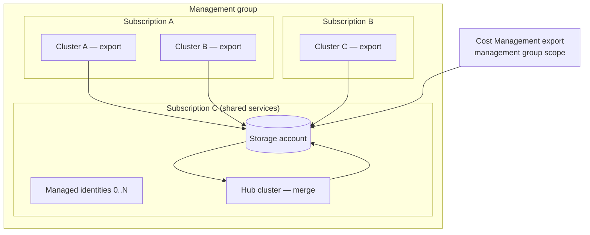

# Day-2 operations and troubleshooting

## How it runs, day to day

Once deployed, the solution is entirely schedule-driven — there's no long-running
service, no ingress, nothing to keep "up." Each day:

1. Every participating cluster's `export` CronJob fires (default `10 0 * * *`, i.e.
   00:10 UTC), runs for well under a minute, uploads that cluster's CSV, and exits.
2. Azure Cost Management's own daily export runs on its own schedule (configured at
   export-creation time), landing a fresh CSV(.gz) under `cost-management/` in blob
   storage — this is entirely managed by Azure, not by this solution.
3. The centralized `merge` CronJob fires after the exports (default `30 0 * * *`),
   reads everything, joins it, and overwrites `cost-analysis/result.csv`.
4. Downstream consumers (Power BI, a scheduled data pipeline, manual download) pick up
   the refreshed `result.csv` on whatever cadence they need.

There is no persistent compute cost between runs — CronJobs only consume cluster
resources while a Job is actually executing.

## Running CronJobs manually

You'll do this constantly: after every deployment, image update, or configuration
change, and any time you're debugging. Never wait for the daily schedule to find out
whether something works.

### Trigger a run

```powershell
kubectl create job --from=cronjob/aks-cost-analysis-export manual-1 -n cost-analysis
```

For the merge job, substitute `cronjob/aks-cost-analysis-merge`. In a single-cluster
`both`-mode deployment the CronJob is named `aks-cost-analysis-both`; confirm with
`kubectl get cronjobs -n cost-analysis`.

Job names must be unique within the namespace, so increment the suffix on each rerun
(`manual-2`, `manual-3`) or delete the previous one first.

### Watch it run

```powershell
# Job and pod status
kubectl get jobs,pods -n cost-analysis

# Block until it finishes (or fails the timeout)
kubectl wait --for=condition=complete --timeout=300s job/manual-1 -n cost-analysis

# Stream logs
kubectl logs -n cost-analysis -l job-name=manual-1 --tail=200 -f
```

A healthy run always ends with `data processing completed successfully`. A merge run
also logs `wrote result rows count=N` and `joined data uploaded successfully`.

If the pod never reaches `Running`, the logs will be empty and the reason is in the
events:

```powershell
kubectl describe pod -n cost-analysis -l job-name=manual-1
```

`ImagePullBackOff` points at registry permissions or network path. `Pending` usually
means no schedulable node.

### Clean up

```powershell
kubectl delete job manual-1 -n cost-analysis
```

Manually created Jobs aren't covered by the CronJob's history limits, so they accumulate
until deleted.

### Private clusters

With no public API server endpoint, `kubectl` from a workstation won't connect. Run the
same commands through the cluster instead:

```powershell
az aks command invoke -n <cluster> -g <cluster-rg> `
  --command "kubectl create job --from=cronjob/aks-cost-analysis-export manual-1 -n cost-analysis"

az aks command invoke -n <cluster> -g <cluster-rg> `
  --command "kubectl logs -n cost-analysis -l job-name=manual-1 --tail=200"
```

This needs the `Microsoft.ContainerService/managedClusters/runcommand/action`
permission. The alternative is a jump box inside the VNet.

### Suspending and resuming a schedule

Useful during maintenance or while investigating a misbehaving cluster:

```powershell
kubectl patch cronjob aks-cost-analysis-export -n cost-analysis -p '{"spec":{"suspend":true}}'
kubectl patch cronjob aks-cost-analysis-export -n cost-analysis -p '{"spec":{"suspend":false}}'
```

A suspended CronJob doesn't backfill missed runs when resumed. The cluster simply
contributes no data for those days, and the merge job has no way to know it's missing —
see the last entry in the troubleshooting playbook.

## Downloading the reports from blob storage

The merged output is `cost-analysis/result.csv`. Raw per-cluster exports live under
`cost-analysis/<cluster>/export-<date>.csv`, and raw Cost Management data under
`cost-management/**/*.csv.gz`.

### A note on authentication

Only the workload identity holds a data-plane role on the storage account. Your own
account almost certainly doesn't, so `--auth-mode login` returns 403 and the commands
below use the account key instead. If you'd rather use your own identity, assign
yourself **Storage Blob Data Reader** on the storage account and swap `--account-key
$KEY` for `--auth-mode login`.

### List what's available

```powershell
$SA  = "<storage-account>"
$RG  = "<shared-resource-group>"
$KEY = az storage account keys list -n $SA -g $RG --query "[0].value" -o tsv

az storage blob list --account-name $SA --account-key $KEY -c cost-exports `
  --query "[].{name:name, sizeBytes:properties.contentLength, modified:properties.lastModified}" -o table
```

Use this to confirm every expected cluster has a recent file, and that `result.csv`'s
timestamp advanced today.

### Download the merged report

```powershell
az storage blob download --account-name $SA --account-key $KEY `
  -c cost-exports -n "cost-analysis/result.csv" -f result.csv
```

### Download one cluster's raw export

```powershell
az storage blob download --account-name $SA --account-key $KEY `
  -c cost-exports -n "cost-analysis/<cluster>/export-2026-09-09.csv" -f export.csv
```

### Download everything under a prefix

Useful for offline analysis or handing a month of raw data to a finance team:

```powershell
az storage blob download-batch --account-name $SA --account-key $KEY `
  -s cost-exports --pattern "cost-analysis/*" -d .\downloads
```

### Automate the daily pull

For a scheduled pipeline, use AzCopy with the same account key or a short-lived SAS
token rather than shelling out to `az` per file:

```powershell
$SAS = az storage blob generate-sas --account-name $SA --account-key $KEY `
  -c cost-exports -n "cost-analysis/result.csv" --permissions r `
  --expiry (Get-Date).AddHours(1).ToString("yyyy-MM-ddTHH:mm:ssZ") -o tsv

azcopy copy "https://$SA.blob.<storage-suffix>/cost-exports/cost-analysis/result.csv?$SAS" ".\result.csv"
```

Replace `<storage-suffix>` with `core.usgovcloudapi.net` in Azure Government or
`core.windows.net` in public cloud. For Power BI, point the connector at the blob
directly instead of downloading — see
[Blob storage and reporting](08-blob-storage-and-reporting.md).

### Validate what you downloaded

```powershell
$r = Import-Csv .\result.csv
$r.Count
$r[0].PSObject.Properties.Name          # confirms which Cost Management schema you got
$r | Group-Object ClusterName | Select-Object Name, Count
```

The leading columns are always `ClusterName, Name, Kind, SplitBucket, Fraction,
SplitKey`, followed by every column from your Cost Management export. Which cost column
you have depends on the billing account type — `PreTaxCost` for EA and pay-as-you-go,
`CostInBillingCurrency` for MCA, `BilledCost` or `EffectiveCost` for FOCUS.

The check worth doing after any change: cost columns are multiplied by `Fraction`, and
fractions sum to 1 per resource per day, so the total in `result.csv` for a given date
must match the portal's **Cost analysis** view for the cluster's node resource group on
that date.

```powershell
$day = "2026-09-08"
($r | Where-Object UsageDateTime -eq $day | Measure-Object PreTaxCost -Sum).Sum
```

A higher total means fractions are summing above 1 (double counting). A lower total
means some cost rows failed to join.

## Monitoring what matters

| What to watch | How |
|---|---|
| CronJob run history | `kubectl get jobs -n cost-analysis` on each cluster — look for `Complete` vs. accumulating `Failed` Jobs. |
| Job logs | `kubectl logs -n cost-analysis -l job-name=<job-name>` — the app logs structured `slog` output; a healthy run always ends with `data processing completed successfully`. |
| `result.csv` freshness | Check the blob's `Last Modified` timestamp — if it's stale by more than one day, something in the merge chain broke silently. |
| Per-cluster export freshness | List `cost-analysis/` and confirm every onboarded cluster has a file dated today. A cluster whose export job is failing contributes nothing and raises no error anywhere. |
| Cost Management export health | `az rest --method GET .../providers/Microsoft.CostManagement/exports/<name>/runHistory?api-version=...` — confirm the most recent run's `status` is `Completed`, not stuck in `InProgress` or showing `Failed`. |
| Federated credential count | `az identity federated-credential list --identity-name <identity> --resource-group <rg>` per shared identity — track against the 20-per-identity default quota as you onboard more clusters. |

**Recommended for a real fleet**: forward CronJob/Job failure events to Log
Analytics/Container Insights (if enabled on the clusters) and alert on: any `Failed`
Job, or an absence of a `Complete` Job within the expected daily window. This solution
doesn't include built-in alerting — it's intentionally self-hosted/self-supported, so
wire this into whatever the customer already uses for cluster observability.

## Operating at scale: many clusters across subscriptions

The POC topology (one cluster, one subscription, `both` mode) and the production topology
(dozens of clusters spread across subscriptions, regions, and resource groups) are the
same code with different configuration. What changes is what you have to keep track of.

### The production topology



### What's shared and what's per-cluster

| Component | Instances | Notes |
|---|---|---|
| Storage account and container | 1 | Any subscription. The only thing every cluster touches. |
| Managed identity | 1 per 20 clusters | Federated credential quota, not a design choice. |
| `Storage Blob Data Contributor` assignment | 1 per identity | Scoped to the storage account. |
| Cost Management export | 1 per billing scope | Management group scope covers all child subscriptions. |
| Federated credential | 1 per cluster **per operation mode** | A hub cluster that also exports needs two. |
| Export CronJob | 1 per cluster | Cluster-specific `AZURE_STORAGE_AKS_DATA_PREFIX`. |
| Merge CronJob | 1 for the whole fleet | Reads the shared root prefix. |
| Terraform state | 1 shared + 1 per cluster + 1 merge | Per-cluster state keeps failures isolated. |

### What subscription boundaries do and don't affect

Nothing at runtime crosses a subscription boundary except blob traffic, because no
component ever calls a cluster. Clusters can be private, in any region, in any
subscription, and in any tenant-visible management group without additional networking.

Three things do have to account for the boundary:

1. **Cost Management export scope.** A subscription-scoped export only contains that
   subscription's costs. Clusters elsewhere upload their Kubernetes splits, find no
   matching cost rows, and silently contribute nothing. Use management group scope, or
   create one export per subscription pointing at the same container.
2. **Role assignments.** Each shared identity needs `Storage Blob Data Contributor` on
   the storage account. That's one assignment per identity regardless of how many
   subscriptions the clusters live in — the identity is the grantee, not the cluster.
3. **Image distribution.** Every cluster's kubelet identity needs `AcrPull` on the
   registry. One registry serving all clusters is simplest; geo-replication is worth
   considering for clusters far from the registry's region.

### Limits to plan around

| Limit | Value | What to do |
|---|---|---|
| Federated credentials per managed identity | 20 (default) | Raise `identity_count`, assign new clusters a higher `identity_shard_index`, or request a quota increase early |
| Cost Analysis add-on | Requires Standard or Premium tier | Free tier clusters need a tier change first — a billing conversation, not a technical one |
| Cost Management export scope | One scope per export | Management group scope for multi-subscription fleets |
| Storage account throughput | Not a practical constraint | Daily export volumes are small; one account serves dozens of clusters comfortably |
| Merge job runtime and memory | Grows with fleet size and retention window | The container requests 512Mi/500m; raise it if the merge job is OOMKilled as the fleet grows |

### Onboarding runbook

For each new cluster:

1. Confirm the tier is Standard or Premium.
2. Enable OIDC issuer, workload identity, and the Cost Analysis add-on.
3. Grant its kubelet identity `AcrPull` on the registry.
4. Confirm the Cost Management export scope covers its subscription. If not, extend the
   scope or add an export.
5. Pick an `identity_shard_index` with fewer than 20 credentials in use.
6. Deploy the export workload and run it manually to validate.
7. Confirm its file appears under `cost-analysis/<cluster>/`.

Steps 4 and 5 are the two that get skipped and cause silent data gaps weeks later.

### Offboarding runbook

1. Remove the cluster's workload (`terraform destroy` on its state, or
   `kubectl delete namespace cost-analysis`).
2. Delete its federated credential from the shared identity, freeing a quota slot.
3. Delete its files under `cost-analysis/<cluster>/`.

Step 3 matters. The merge job has no cluster registry, so it can't tell a decommissioned
cluster from one that hasn't run yet. Stale files keep appearing in `result.csv` until
they're deleted or expire under the lifecycle policy.

### Checking fleet health in one pass

```powershell
$KEY = az storage account keys list -n $SA -g $RG --query "[0].value" -o tsv
$expected = @("aks-prod-eastus", "aks-prod-westus", "aks-dev-eastus")
$today = (Get-Date).ToUniversalTime().ToString("yyyy-MM-dd")

$blobs = az storage blob list --account-name $SA --account-key $KEY -c cost-exports `
  --prefix "cost-analysis/" --query "[].name" -o tsv

foreach ($c in $expected) {
  $hit = $blobs | Where-Object { $_ -like "cost-analysis/$c/export-$today.csv" }
  [pscustomobject]@{ Cluster = $c; ReportedToday = [bool]$hit }
}
```

Run this after the export window and before the merge window. Any `False` is a cluster
that will be missing from today's `result.csv`.

For more on why clusters need no knowledge of each other, see
[How data is collected across clusters](09-multi-cluster-data-collection.md).

## Routine (day-2) maintenance tasks

- **Image updates**: rebuild (`az acr build`) and update the `image` variable in
  each cluster's `terraform.tfvars`, then `terraform apply`. The CronJob spec updates
  in place — no need to delete/recreate anything. Validate with a manual test Job
  (see [Running CronJobs manually](#running-cronjobs-manually)) after every image change.
- **Onboarding a new cluster**: repeat the per-cluster deployment steps. Nothing on the
  merge side or shared infrastructure needs to change — the merge job already scans
  the shared root prefix and will pick up the new cluster's data automatically once its
  export job runs.
- **Decommissioning a cluster**: `terraform destroy` that cluster's `envs/cluster`
  state (removes its federated credential, ServiceAccount, namespace resources, and
  CronJob), and separately delete its old data under `cost-analysis/<cluster>/` in
  blob storage if it should no longer appear in `result.csv` (the merge job has no
  automatic pruning — stale clusters' last-known data will keep appearing in the join
  until their raw files are removed or age out via the storage lifecycle policy).
- **Storage lifecycle policy**: default retention for raw per-cluster exports and raw
  Cost Management files is 30 days — adjust `raw_export_retention_days` in
  `modules/shared` if the customer needs longer raw-data retention for audit purposes.
  `result.csv` itself is never auto-expired.
- **Federated credential quota approaching**: if nearing 20 credentials on a shared
  identity, either request an Azure support quota increase (start this well before
  it's actually needed) or provision an additional shared identity
  (`identity_count` in `modules/shared`) and start pointing new clusters at the new
  shard via `identity_shard_index`.

## Troubleshooting playbook

### Export job fails, log shows an HTTP error calling the agent
- **Symptom**: `failed to reach cost analysis service` or a non-200 status in the logs.
- **Check**: does `kube-system/cost-analysis-agent-svc` exist and does its selector
  match a running `cost-analysis-agent` pod?
  ```powershell
  kubectl get svc -n kube-system cost-analysis-agent-svc
  kubectl get pods -n kube-system -l app=cost-analysis-agent
  ```
  If the Service is missing, the Cost Analysis add-on's agent pod exists but nothing
  exposes it — this Service is created by this solution's own manifests/Terraform, not
  by the add-on itself (a known gap in the add-on). Re-apply `envs/cluster` (or
  `kube.yaml`) for that cluster.
- If the add-on itself isn't enabled or the pod isn't running at all: confirm
  `az aks show --query metricsProfile.costAnalysis.enabled` is `true`, and check the
  cluster's pricing tier is Standard/Premium.

### Export/merge job fails to authenticate to storage
- **Symptom**: an `azidentity`/credential error, or a 403 from Blob Storage.
- **Check**: does the Pod's ServiceAccount have the correct
  `azure.workload.identity/client-id`/`tenant-id` annotations, and is the Pod labeled
  `azure.workload.identity/use: "true"`? Does the federated identity credential's
  `subject` exactly match `system:serviceaccount:<namespace>:<serviceaccount>` for that
  Pod? Federated credential propagation in Entra ID can take a couple of minutes after
  creation — if you just applied Terraform, wait briefly and retry before assuming
  something is misconfigured.
- **Check**: has the role assignment (`Storage Blob Data Contributor`) actually
  propagated? RBAC propagation in Azure can lag by up to a few minutes after creation.

### Merge job finds zero AKS export files
- **Symptom**: `no AKS export files found` in the logs.
- **Check**: is `AZURE_STORAGE_AKS_DATA_PREFIX` on the merge job set to the shared
  root (`cost-analysis/`), not a single cluster's subfolder? Confirm at least one
  export job has actually run and successfully uploaded a file
  (`az storage blob list --prefix cost-analysis/`).

### Merge job finds zero Cost Management files
- **Symptom**: `no cost management files found to process`.
- **Most common cause**: the Cost Management export hasn't executed yet — a brand-new
  export's first scheduled run can be a day or more away. Force an on-demand run (see
  [Terraform deployment guide](06-terraform-deployment-guide.md) step 2.6) rather than
  waiting.
- **Other cause**: `Microsoft.CostManagementExports` resource provider not registered
  on the subscription — the export itself would have failed to create in the first
  place (`RP Not Registered` error), so check that the export resource exists at all.

### Merge job's join query fails with "no resource ID column found"
- **Cause**: the `cost_management` table has no rows — direct symptom of the above
  (no Cost Management data has landed yet). Resolve the underlying cause first; this
  error is downstream of an empty import, not a bug in the join itself.

### `terraform apply` fails creating the Cost Management export (`azapi_resource`)
- **`RP Not Registered` (400)**: register `Microsoft.CostManagementExports` (see
  Deployment guide prerequisites) and retry.
- **Schema validation error mentioning `displayName` or missing `timeframe`**: the
  `azapi` provider validates the request body strictly — `definition.timeframe` is
  required (e.g. `"MonthToDate"`) and `displayName` is not a valid property at all for
  this resource type (unlike the raw ARM REST call in the original `deploy.sh`, which
  isn't schema-validated and silently ignores extra fields).
- **A 401 from `consumption.azure.us` immediately after a successful create, in Azure
  Government specifically**: this is a known quirk — the `azapi` provider's post-create
  polling call goes to a different host than the create call, and that host rejects the
  token audience in Gov cloud. The resource was very likely created successfully
  despite the error. Verify directly:
  ```powershell
  az rest --method GET --uri "https://management.usgovcloudapi.net/subscriptions/<sub-id>/providers/Microsoft.CostManagement/exports/<name>?api-version=2023-07-01-preview"
  ```
  If it exists, reconcile Terraform state rather than retrying the apply:
  ```powershell
  terraform import module.shared.azapi_resource.cost_export "<resource-id>?api-version=2023-07-01-preview"
  terraform untaint module.shared.azapi_resource.cost_export
  ```

### `terraform apply` fails on `envs/cluster` or `envs/merge` with a Kubernetes "already exists" error
- **Cause**: two independent Terraform states (e.g. an export job's `envs/cluster` and
  the merge job's `envs/merge`) are targeting the **same physical cluster**, and both
  are trying to manage the same namespace or a same-named resource. Set
  `manage_namespace = false` (`hub_shares_cluster_with_export = true` in `envs/merge`)
  when the merge hub is also an export cluster, and confirm the federated
  credential/ServiceAccount naming is mode-aware (it is by default in this module —
  see [Terraform modules](05-terraform-modules.md)).

### `result.csv` contains resource groups belonging to clusters you didn't onboard
- **Symptom**: the resource IDs in the merged output span more resource groups than the
  clusters listed in the `ClusterName` column, and the extra rows are all
  `__unallocated__`.
- **Cause**: an image built before the resource group boundary fix. The join used a
  prefix match with no trailing delimiter, so a cluster in `mc_rg-aks_prod_eastus` also
  matched resources in `mc_rg-aks_prod_eastus2`.
- **Fix**: rebuild the image (`az acr build`), roll it out, and run the merge job
  manually. `result.csv` is rewritten from the raw exports on every run, so one corrected
  run repairs every date still inside the retention window. Full diagnostics are in
  [How data is collected across clusters](09-multi-cluster-data-collection.md#diagnosing-unexpected-clusters-in-your-output).

### Nothing obviously wrong, but `result.csv` looks incomplete or stale
- Confirm every expected cluster actually has a recent file under
  `cost-analysis/<cluster>/export-<date>.csv` — a cluster whose export job has been
  silently failing (e.g. tier downgraded, add-on disabled, image pull failure) won't
  raise an error in the merge job; it just won't contribute data, and the merge job
  has no way to know a cluster is "missing."
- Check the merge job's own last run status and logs — a failed merge run simply
  leaves the previous `result.csv` in place (there's no partial/corrupt overwrite,
  since the upload only happens after a successful in-memory join), which can look
  like "stale but not obviously broken" data if not checked directly.
