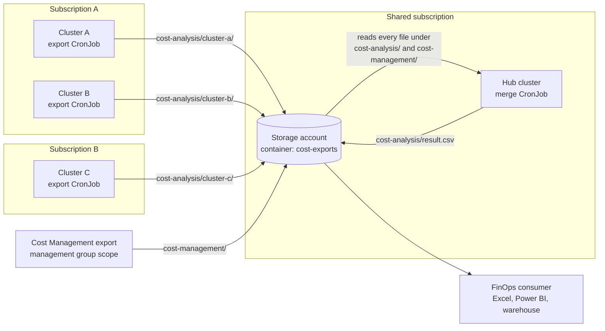

# How data is collected across clusters, subscriptions, and resource groups

A common first reaction after the first successful merge run is: "`result.csv` contains
data about clusters other than the one I deployed to — how did the job reach them?"

It didn't. This document explains what actually happens, why the solution can span
subscriptions and resource groups without any cross-cluster networking, and how to tell
whether data you didn't expect is correct or a symptom of a misconfiguration.

## The short answer

**Nothing in this solution ever connects to another cluster.** There is no cluster
discovery, no kubeconfig handling, no cluster-to-cluster networking, and no Azure
Resource Graph query that enumerates clusters. Each cluster's export job talks to
exactly one thing besides Azure Storage: the Cost Analysis agent running inside its own
`kube-system` namespace.

Clusters are joined together by **a shared blob container**, and nothing else. The merge
job reads files. Whoever wrote those files is irrelevant to it.

## The integration point is blob storage



Read that diagram as two independent halves:

- **Write side (many, parallel).** Every cluster runs an `export`-only CronJob that
  writes one CSV per day to its own folder. Clusters never read each other's data and
  don't know about each other. Adding cluster #51 changes nothing anywhere else.
- **Read side (one, central).** A single `merge`-only CronJob lists everything under the
  root prefix, imports it into a temporary SQLite database alongside the Cost Management
  export, joins it, and writes `result.csv`.

The merge job needs exactly two things: a blob token and network access to the storage
account. It does not need credentials for, or line of sight to, any cluster it's
reporting on — including private clusters in other subscriptions.

## Why this works across subscriptions and resource groups

Because there's no cross-cluster call to make, subscription and resource group
boundaries never come into play at runtime. Only three pieces of configuration have to
line up.

| Requirement | Why | How to satisfy it |
|---|---|---|
| Every cluster's workload identity can write to the one storage account | It's the only shared surface | `Storage Blob Data Contributor` on the storage account for each shared managed identity |
| Every cluster has a federated credential on a shared identity | Each cluster has its own OIDC issuer URL | One federated credential per cluster per operation mode; shard across identities past 20 |
| The Cost Management export covers every subscription that hosts a cluster | A subscription-scoped export only sees its own subscription | Create the export at **management group** scope when clusters span subscriptions |

That last row is the one most often missed. If clusters live in subscriptions A, B, and
C but the Cost Management export is scoped to subscription A, then clusters in B and C
will still upload their Kubernetes-side splits — but the join finds no matching cost
rows, so they contribute nothing to `result.csv` and disappear silently. See
[Azure resources](02-azure-resources.md) for the scope options.

The storage account itself can live in any subscription. So can the hub cluster.

## What makes a row appear in result.csv

Understanding the join is what lets you decide whether unexpected data is correct.

1. The merge job loads every cluster's export rows into `aks_splits`. Each row carries a
   full Azure resource ID, a date, a `ClusterName`, and a fractional attribution to a
   Kubernetes construct.
2. It derives the distinct set of **resource groups** those resource IDs belong to. For
   AKS these are node resource groups, like `MC_<rg>_<cluster>_<region>`.
3. It loads the Cost Management export into `cost_management` — which contains **every
   resource in the export's scope**, not just AKS ones.
4. It inner-joins cost rows onto those resource groups by date, then left-joins the
   fractional splits on the exact resource ID.

So a cost row reaches `result.csv` only if it belongs to a resource group that some
cluster's agent reported on the same day. Everything else in the subscription is
discarded. Cost columns are multiplied by the split fraction, and fractions sum to 1 per
resource per day, so totals are preserved rather than duplicated.

Rows that match a resource group but have no matching split come through tagged
`__unallocated__` with `Fraction = 1`. That's shared cluster infrastructure — load
balancers, public IPs, unattached disks, and any node cost the agent couldn't attribute
to a workload. It's expected, and excluding it would understate the true cost of the
cluster.

## Diagnosing unexpected clusters in your output

Download the merged report first — see
[Operations and troubleshooting](07-operations-and-troubleshooting.md) for the full
download commands:

```powershell
$SA  = "<storage-account>"
$RG  = "<shared-resource-group>"
$KEY = az storage account keys list -n $SA -g $RG --query "[0].value" -o tsv

az storage blob download --account-name $SA --account-key $KEY `
  -c cost-exports -n "cost-analysis/result.csv" -f result.csv
$r = Import-Csv .\result.csv
```

Then work through these in order.

### 1. Which clusters' export files were actually ingested?

```powershell
$r | Group-Object ClusterName | Select-Object Name, Count
```

`ClusterName` is written by the export job into every row of its own CSV, so this tells
you exactly which export files the merge job read. Cross-check against what's in
storage:

```powershell
az storage blob list --account-name <storage-account> --account-key $KEY `
  -c cost-exports --prefix "cost-analysis/" -o table
```

If other clusters appear here, they wrote files to the shared container — which is
correct behavior for a fleet, and a surprise only if you believed you were running a
single-cluster deployment. The usual cause is a job left in `both` mode, or a merge job
whose `AZURE_STORAGE_AKS_DATA_PREFIX` is the shared root `cost-analysis/` rather than
`cost-analysis/<cluster>/`. That's the difference between "this cluster's report" and
"the fleet's report" — see [Blob storage and reporting](08-blob-storage-and-reporting.md).

A value of `__unknown__` means those rows came from export files written before the
`ClusterName` column existed. Expected for older files inside the retention window,
a problem for today's data.

### 2. Which resource groups do the cost rows belong to?

```powershell
$r | Select-Object -ExpandProperty InstanceId | ForEach-Object { ($_ -split '/')[4] } |
  Group-Object | Select-Object Name, Count
```

You should see only node resource groups belonging to clusters that appear in step 1.

### 3. Resource group prefix matching (fixed — check your image)

Earlier builds matched cost rows to a cluster's resource group with a prefix comparison
that had no trailing delimiter:

```sql
-- old, ambiguous
INNER JOIN aks_rg r ON LOWER(c.InstanceId) LIKE r.rg_path || '%'
```

`rg_path` ends at the resource group name, so a cluster in `mc_rg-aks_prod_eastus` also
matched every resource in `mc_rg-aks_prod_eastus2` or `mc_rg-aks_prod_eastus-dr` in the
same subscription. The effect was over-reporting: another cluster's costs were attributed
to yours, tagged `__unallocated__` because no split matched.

The join now anchors on the segment boundary, and the resource group extraction skips
IDs with nothing after the resource group name:

```sql
-- current
WHERE ID LIKE '/subscriptions/%/resourceGroups/%/%'
...
INNER JOIN aks_rg r ON LOWER(c.InstanceId) LIKE r.rg_path || '/%'
```

If step 2 returns resource groups belonging to clusters that did **not** appear in
step 1, you're running an image built before this fix. Rebuild and roll it out:

```powershell
az acr build --registry <acr-name> --image aks-cost-export:latest .
kubectl create job --from=cronjob/aks-cost-analysis-merge remerge-1 -n cost-analysis
```

The merge job rewrites `result.csv` from the raw exports on every run, so a single
corrected run repairs the output for every date still inside the retention window — no
backfill needed.

## What this means for onboarding

Because clusters are decoupled, onboarding is genuinely additive:

- Adding a cluster requires work **only on that cluster**, plus one federated credential
  on a shared identity. The merge job, the storage account, and the Cost Management
  export are untouched.
- Removing a cluster means deleting its workload, and separately deleting its files
  under `cost-analysis/<cluster>/`. The merge job has no cluster registry, so it can't
  tell "decommissioned" from "hasn't run yet" — stale files keep contributing until
  they're removed or expire under the lifecycle policy.
- A cluster whose export job is silently failing simply stops contributing. Nothing
  errors. Monitor per-cluster file freshness, not just merge job success — see
  [Operations and troubleshooting](07-operations-and-troubleshooting.md).

## Related reading

- [Architecture](01-architecture.md) — phase-by-phase sequence diagrams and the join data model
- [Blob storage and reporting](08-blob-storage-and-reporting.md) — folder layout and per-cluster vs. fleet-wide granularity
- [Azure resources](02-azure-resources.md) — Cost Management export scope options
- [Permissions and RBAC](03-permissions-and-rbac.md) — identity sharding and the federated credential quota
